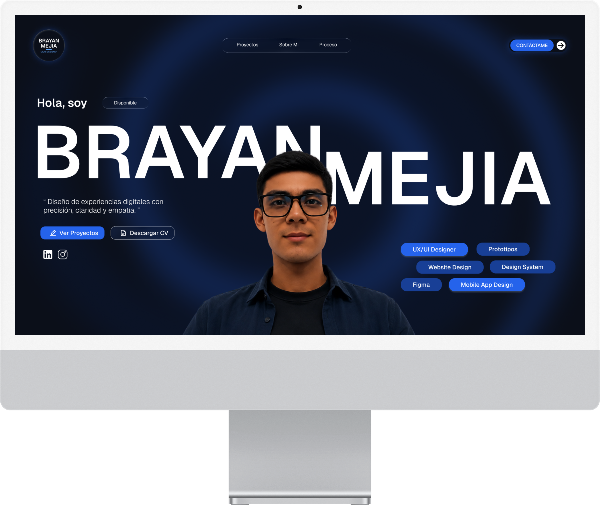
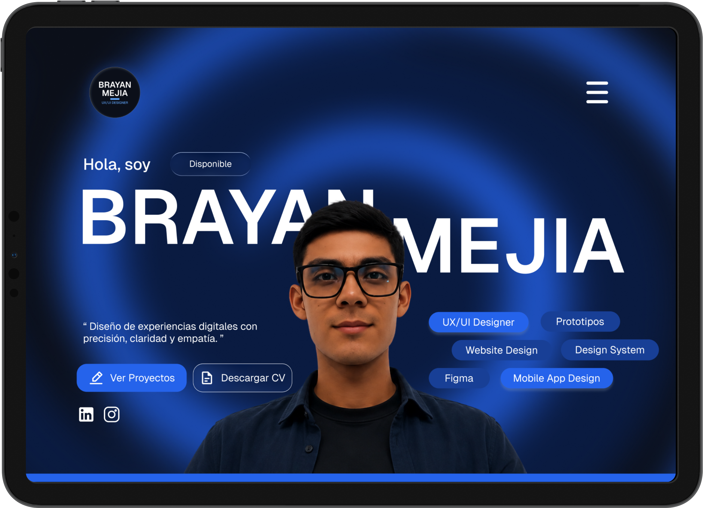
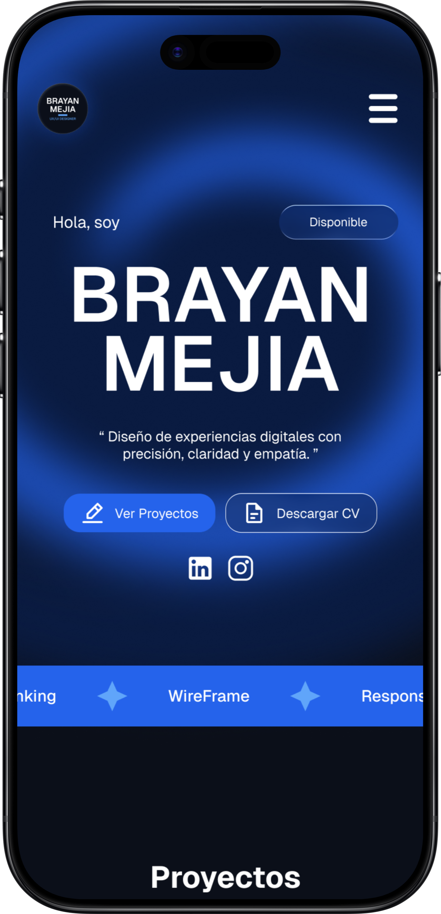

# Portafolio — Brayan Mejía (UX/UI Designer)

## Español

Bienvenido a mi portafolio digital, un espacio donde el diseño UX/UI cobra vida. Construido con **Astro**, este sitio es completamente bilingüe (**ES/EN**) e invita a explorar mi trabajo a través de una experiencia visual inmersiva: 4 proyectos de diseño reales (Biblioteca, Wagly, Landing Yamaha e Intercom Pro), un recorrido por mi proceso de diseño, un formulario de contacto listo para conversar y un conmutador de idioma integrado para cambiar entre español e inglés en un clic.

## English

Welcome to my digital portfolio, a space where UX/UI design comes to life. Built with **Astro**, this site is fully bilingual (**ES/EN**) and invites you to explore my work through an immersive visual experience: 4 real design projects (Biblioteca, Wagly, Yamaha Landing and Intercom Pro), a walkthrough of my design process, a contact form ready to talk and a built-in language switcher to toggle between Spanish and English in one click.

---

## Tecnologías / Technologies

### Español

- ⚡ **Astro 7** — Estructura ultrarrápida con páginas dinámicas.
- 🎨 **Tailwind CSS v4** — Estilos modernos y consistentes.
- 🛡️ **TypeScript** — Código seguro y mantenible.
- 🌍 **i18n** — Rutas dinámicas `/[lang]/` con soporte es/en.

### English

- ⚡ **Astro 7** — Blazing-fast structure with dynamic pages.
- 🎨 **Tailwind CSS v4** — Modern, consistent styling.
- 🛡️ **TypeScript** — Safe and maintainable code.
- 🌍 **i18n** — Dynamic `/[lang]/` routes with es/en support.

---

## Vistas / Mockups

Diseño responsive pensado para cada pantalla, del desktop al iPhone.

| Desktop | Laptop |
| :---: | :---: |
|  |  |

| Tablet | iPhone |
| :---: | :---: |
|  |  |